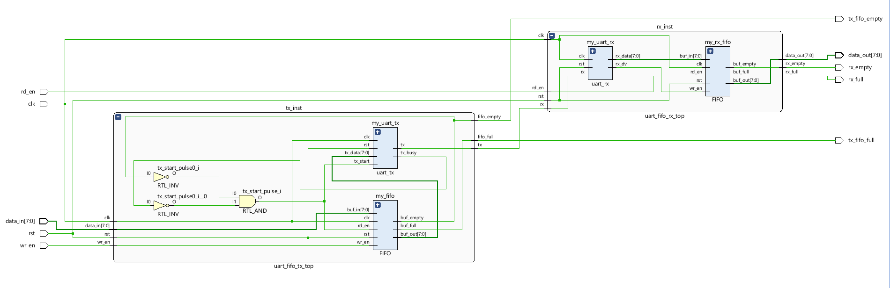
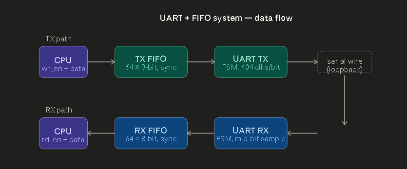
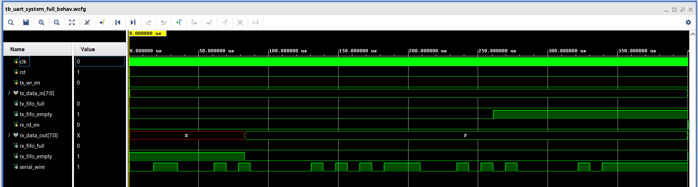
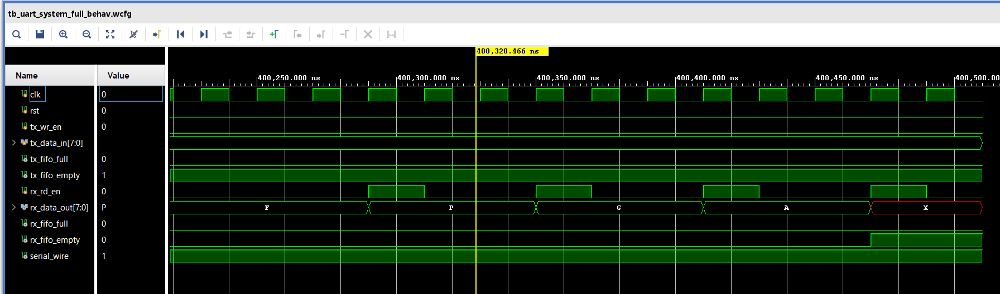
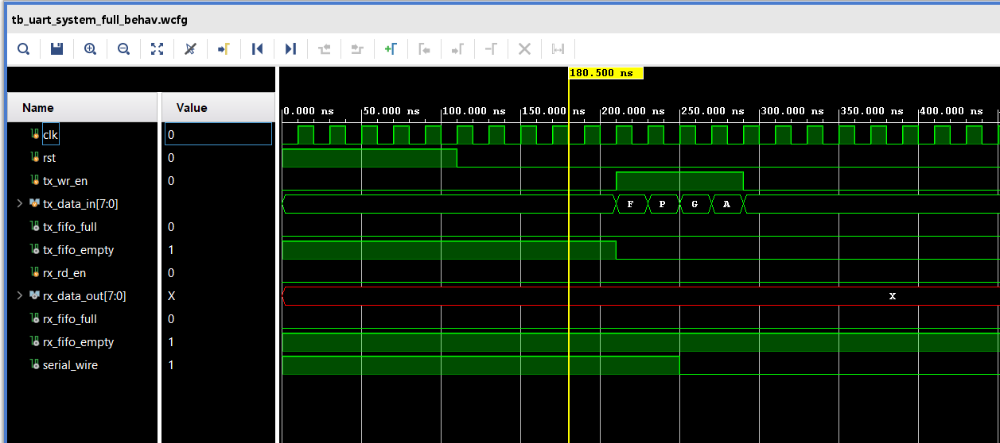

# UART-FIFO-Verilog
A complete, RTL-verified UART and FIFO buffered communication system written in Verilog, featuring decoupled clock domains and mid-bit sampling.
<h3>UART_FIFO_Block_Design</h3>

<h3>architecture_diagram</h3>

<h3>finale_simulation_result</h3>

<h3>simulation_finale</h3>

<h3>simulation_intial</h3>

